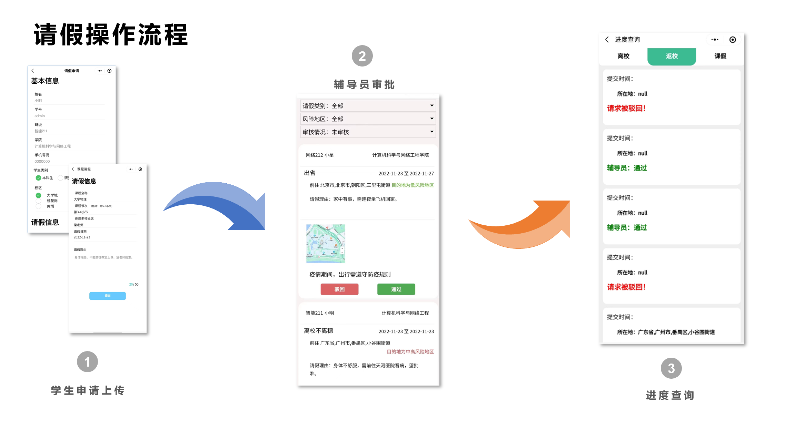
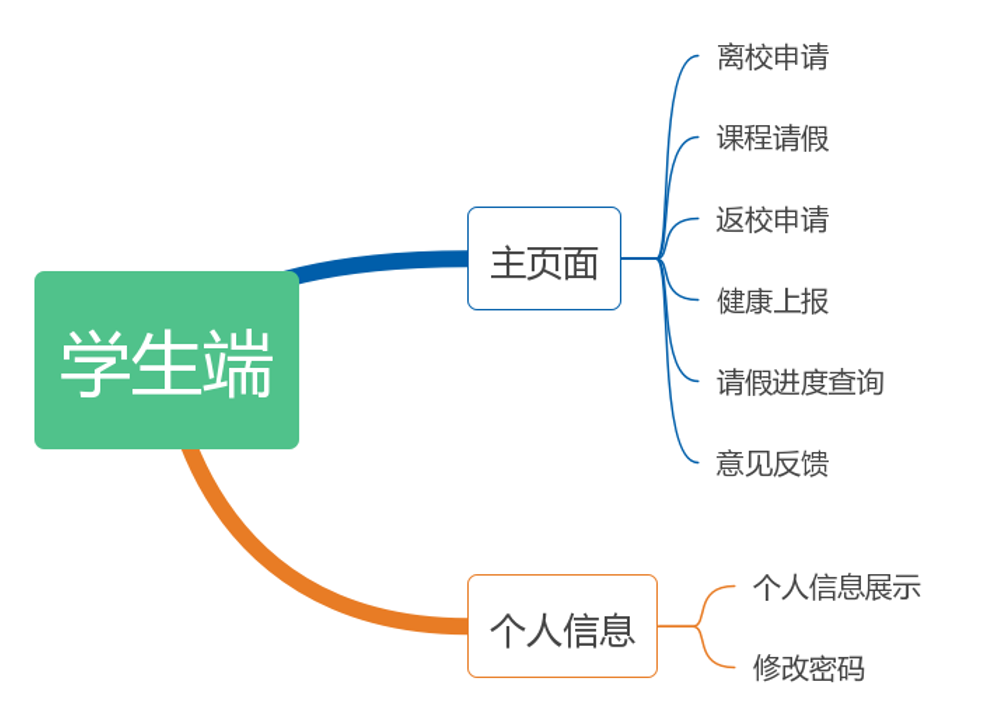
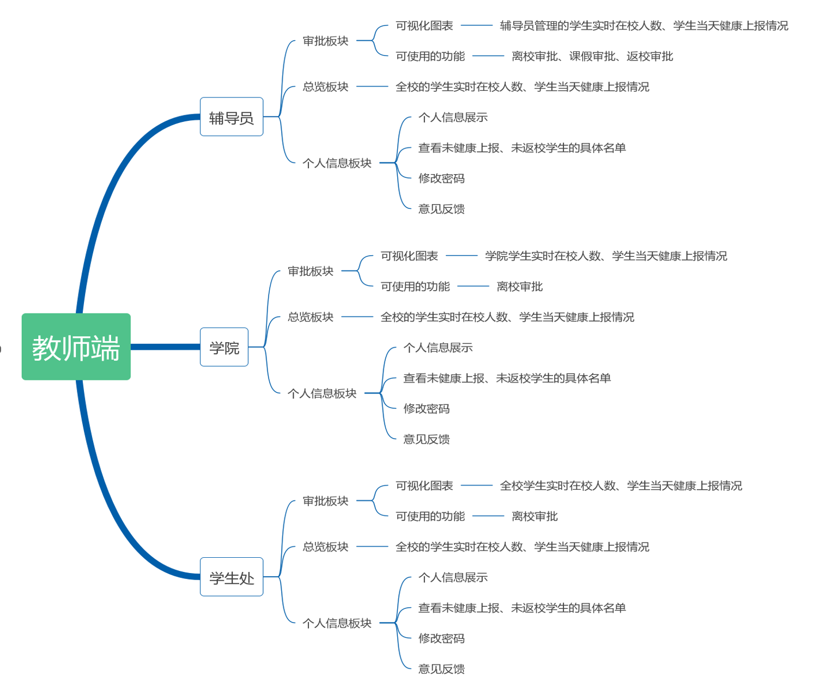

# "悦假宝"微信小程序

## 项目简介  

> “悦假宝”基于疫情大背景，辅助校园开展健康上报、学生病假课假审批和离校审批工作，确保校园师生健康，同时致力于以更高效，更便捷的方式帮助学校清晰解决校园疫情隐患

******
## "悦假宝"演示视频

> 展示了小程序的基本功能和特点，视频时长约2min

[https://www.bilibili.com/video/BV1sN411475D/?spm_id_from=333.999.0.0&vd_source=e7b8dac96809df640fbff895c11a888f](https://www.bilibili.com/video/BV1sN411475D/?spm_id_from=333.999.0.0&vd_source=e7b8dac96809df640fbff895c11a888f)

*****
## 设计思路

> 项目总体分为学生端和教师端，学生端主要用于离校申请与健康打卡；教师端再细分为三种角色：辅导员、学院、学生处，通过权限设计对三种角色赋予不同的功能

